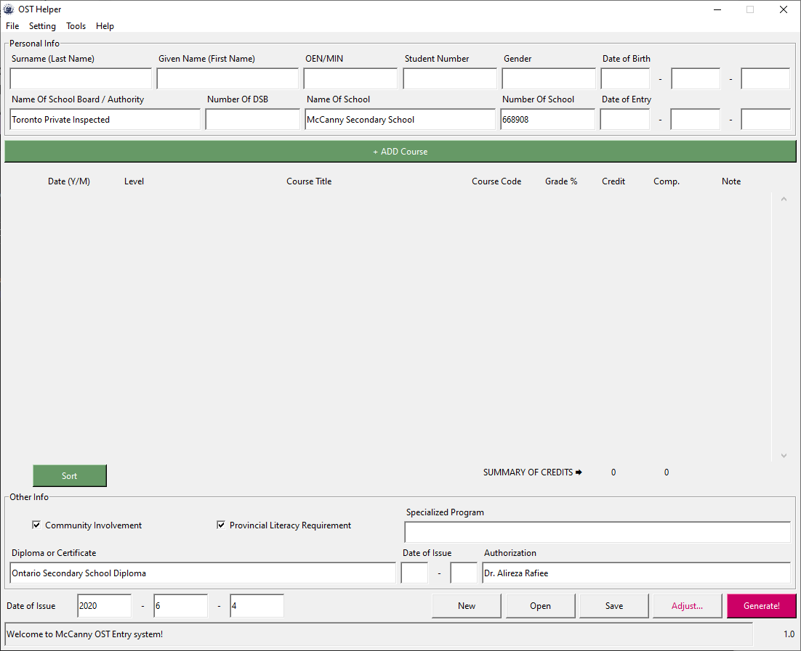
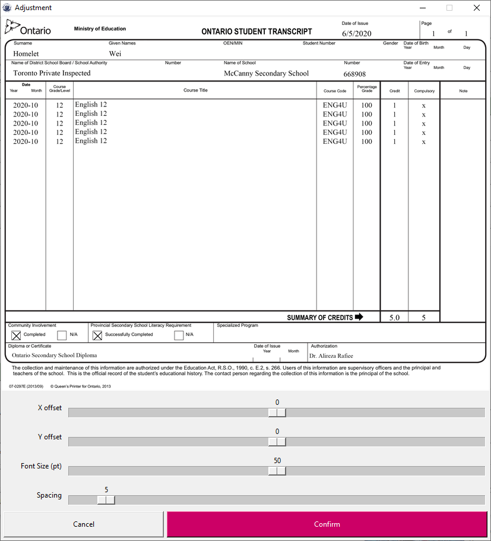
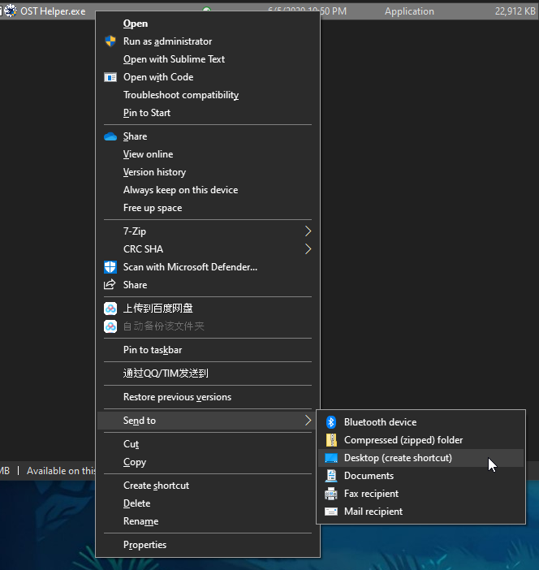
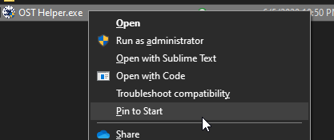

# OST Helper
Made for McCanny Seconday School, Dev by Hongcheng Wei ([homeletwei@gmail.com](mailto::homeletwei@gmail.com)).

## Overview
OST Helper is a program that helps to create and modify Ontario Student Transcript (OST) easily. 

### Features
- OST Helper saves each OST as an [json file](https://en.wikipedia.org/wiki/JSON) (basically a text file), which makes storing and transporting them easily (takes less space).
- User can choose to export the OST to PDF either with template in the background (good for backup), or without template in the background (good for print).
- The `Smart Fill` and `Train` feature helps quickly add course to the OST, check out [Smart Fill and Train](#smart-fill-and-train).
- The `Adjust` feature provides you the ability to changes the fout size and spacing of the OST to suit your need, check out [Adjustment](#using-adjustment).
- Production Tool helps to create OST in batches, more detail in production tools, check out [Production Tool](#using-production-tool).

## Get Started

First [Install OST Helper](#install-ost-helper), after the program is correctly installed, run the program and you will be greeted with the main screen:

The layout of OST Helper should be familiar. Every field corrospond with a field in OST. But there are still some adjustment made:

1. Date of issue is moved to the bottom of the screen.
2. The Summary of Credit is automatically calculated.
	- The credit count is the sum of all `Credit` you have input. For example, if you have `0.5` and `1`, the credit count will appear `1.5` (Note: this count ignores all NaN reference).
	- The composary count is the number of courses that has something in `comp.` (that is the `comp.` field is not empty).
3. There is a `Sort` button under all of the `Date (Y/M)` field. The function of this button is to sort the course by the order of date in assending order (i.e. from before to after). The accepted format of date include:
	- `2000\10`
	- `2000/10`
	- `2000-10`
	- `2000.10`
	- `2000 10`

To add a course, press `+ ADD Cource` button, and a course will appear at the end of the list.

There are a handful of tips and trick about adding course that can help speed up the process.
- Up arrow, Down arrow, Left arror, Right arror moves the focus in their expected direction.
- Press on the red `x` deletes that course.
- `Enter` and `Tab` also moves you to the next field. (`Enter` is prefered)
- `Smart Fill` and `Train` feature helps adding course quickly, detail about this feature, check out [Smart Fill and Train](#smart-fill-and-train).
	- Note that the `Course Code` is the Entry of `Smart Fill`, pressing any key that cause you moves foucs away from `Course Code` triggers `Smart Fill` (i.e. When you have focus on `Course Code`, Up, Down, Left, Right, Enter, Tab triggers `Smart Fill`).

After Finnish filling the required field, save your work by pressing `Save` in the bottom bar or in `File` menu.

__*Note that OST Helper don't save the file automatically, it only saves when you press `Save` and when you exit the program.*__

Now you are ready to generate the OST to PDF, but you might want to preview what the OST looks like, press the `Adjust...` button in the bottom bar to make look at a preview. More about Adjustment, check out [Adjustment](#using-adjustment).

Now after you inspect the OST and made the adjustment, press `Generate!` button, choose your output directory and leave the rest to OST Helper.

Note that you have two option in OST Helper in generating OST:
- With OST Template, good for direct use and back up.
- Without OST Template, good for printing on offical OST paper.

To toggle output with or without template, toggle `Draw OST Template when output` in `Setting` menu.

Other things to Note of:
1. The default name of the OST file and the generated file is in the following format:
	- `[FIRST NAME] [LAST NAME]_[OEN]_OST`
1. To start a new draft press `New` in the bottom bar or in `File` menu. This will save the current OST if you have already saved this file before, otherwise it will ask you to save to a location.
1. To open an existing OST file, press `Open` in the bottom bar or in `File` menu. This will also save the current OST, the save behavior is identical to `New`.
1. To drop all info and reset every thing to the factory condition, press `Reset` in the `File` menu, Note that _*`Reset` will not ask you to save the current file*_, if you want to start a new file use `New`.
1. The `Smart Fill` and `Train` feature can be toggled off, toggle `Smart Fill` and `Train` in the `Setting` menu.

## Smart Fill and Train
Smart Fill and Train is an assistant feature that helps users to add courses quickly. As the user spends more time with this program, this feature also becomes more and more helpful.

_Note that `Smart Fill` and `Train` feature can be toggled off, toggle `Smart Fill` and `Train` in the `Setting` menu._

### Smart Fill
To use smart fill, start typing a Course Code in `Course Code` field and then press _Up Arror Key or Down Arror Key or Left Arror Key or Right Arror Key or Enter Key or Tab Key_ all triggers Smart Fill (pressing any key that cause you moves foucs away from `Course Code` triggers `Smart Fill`, *Note that mouse click to other field don't trigger `Smart Fill`*) . 

When `Smart Fill` is triggered, the program will look for the Course Code (not case sensitive) you just typed in the CCCL (Common Course Code Libary), if a reference is found, it will fill `Level`, `Title`, `Credit`, `Comp.` for you. (_Note that if any of `Level`, `Title`, `Credit`, `Comp.` already have value, Smart fill will not perform!_)

### Train
Train is the twin feature of Smart Fill, the purpose of Train is to build `CCCL` (Common Course Code Library). CCCL is a place where all _valid_ Course you have inputed saves. Compare to Smart Fill, the activation of `Train` is completely passive (You can tell that a `Train` cycle is performed in the status bar). Here is when will Train will perform:
- When you lost focus of the Course panel.
- Before exitting OST Helper.

CCCL (Common Course Code Library) only saves the _valid_ course that you inputted. An _valid_ course must have an `Course Code` and `Level` and `Title` and `Credit`, that means the corrosponding field must not empty at the time a train cycle perform.

CCCL is saved to `resource/CCCL.json`.

## Using Adjustment
Adjustment Window provides several funtionality to fine tune the layout of the OST. 
- A preview of the OST.
	- Note that if the OST consist several page, the preview will only display the first page.
- A slider that change the `x offset`.
- A slider that change the `y offset`.
- A slider that change the `Font size` (in pt) of the courses.
	- This slider changes the font size, if you want to squeeze more line in one page, change the font to the smallest acceptable size.
- A slider that change the `Spacing` of the courses.
	- This slider changes the space between each line (this slider goes as low as -10). Any value below 0 means there will be some overlap on the text, this should be the secondary option when you want to squeeze more line in one page.

## Using Production Tool
Production tool helps you generate OST to PDF in batches. 

First put all OST file you want to process in a Directory (this will be refered as `Production Directory`), and then create another directory for output (this will be refered as `Output Location`). Then you can open the Production Tool by clicking `Production Tool` in `Tools` menu. Choose the Production Directory and Output Location then press `Start Production` to start a production.

> Every file in the Production Directory will be processed to generate an OST report (if possible) and saved to the Output Location with the default file name. If the file name already exists in Output Location, it won't be overwritten unless _Overwrite when necessary_ is checked.

Defaultly, if the PDF already exsist in the Output Location, it won't be overwritten. To disable this behavior check `Overwrite Output files when necessary`.

## Install OST Helper
To install OST Helper, download the latest installer from [hear](https://github.com/Homelet/OST/blob/master/Release/V%201.1/OST%20Helper_v1.1_installer.exe?raw=true), double click to run the OST Helper installer. The installer will prompt you where to install. After the installation is complete, open the folder that the program is installed in and double click `OST Helper.exe` to run OST Helper. There might be a short delay after you double click to run the program, this is normal.

You can also create [a desktop shortcut](#how-to-create-desktop-shortcut) and [a start menu shortcut](#how-to-create-start-menu-shortcut).

See previous Release of OST Helper, check [here](Release).

## Frequent Asked Question

### How to create Desktop Shortcut
To create a desktop shortcut, follow the below instruction.

Right click on the program ➡Send to➡Desktop (create shortcut)

### How to create Start menu Shortcut
To create a Start menu shortcut, follow the below instruction.

Right click on the program ➡Pin to Start

